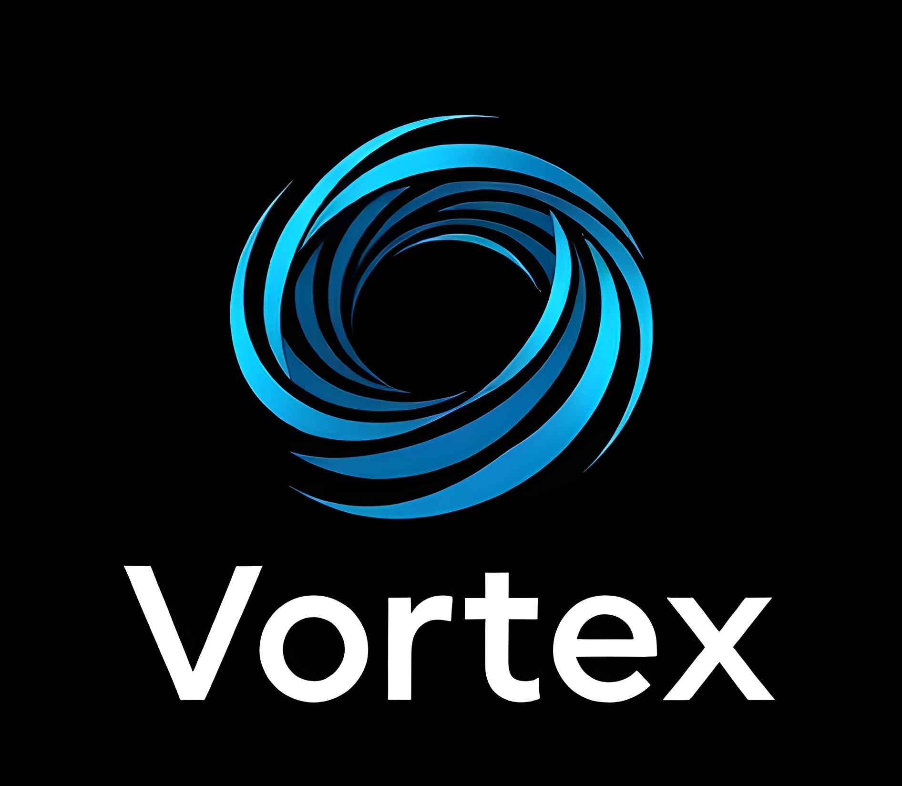

# Vortex 🌀️✨

---

  

**Vortex** is a powerful, flexible, and typed state management solution for TypeScript and JavaScript projects. It provides a reactive, event-driven architecture with support for dependency injection, computed properties, plugins, and a strong focus on type safety.

## Overview

This repository contains multiple packages for the Vortex state management solution:

- **[Vortex](packages/vortex/README.md)**: Core library for type-safe state management, suitable for various JavaScript and TypeScript frameworks.
- **[Vortex Devtools](packages/vortex-devtools/README.md)**: Devtools to enhance your experience with Vortex by providing insightful state debugging and tracking.

Each package has its own `README.md` file with detailed documentation, installation instructions, and usage examples.

## Features 🚀

- 🔒 **Type-safe**: Full control over your state and actions with TypeScript.
- ⚡ **Minimal re-renders**: Optimized component reactivity for better performance.
- 🌐 **Framework-agnostic**: Works seamlessly with any JavaScript framework.
- 🔌 **Extensible**: Supports plugins and middleware for extra functionality.
- 🛠 **Devtools support**: Powerful debugging tools provided by Vortex Devtools.
- 🪶 **Lightweight**: Only ~2.5kB in size with no external dependencies.
- 🤩 **Great Developer Experience**: Easy to use, flexible, and scalable for projects of any size.

## License

MIT

