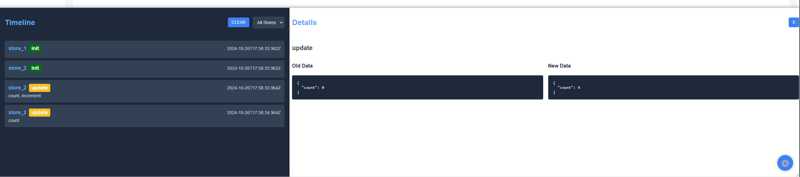

# Vortex

[](https://bundlephobia.com/result?p=@vegajs/vortex)
[](https://www.npmjs.com/package/@vegajs/vortex)
[](https://www.npmjs.com/package/@vegajs/vortex)

<p align="center">
   
</p>

**Vortex** is a powerful, flexible, and typed state management solution for TypeScript and JavaScript projects. It provides a reactive, event-driven architecture with support for dependency injection, computed properties, plugins, and a strong focus on type safety.

## Features 🚀

---
- 🔒 **Type-safe** No `any` types, ensuring you have full control over your state and actions with TypeScript.
- ⚡ **Minimal re-renders** Components only re-render when necessary, improving performance.
- 🌐 **Framework-agnostic** Works seamlessly with React, Vue, or any other framework.
- 🔌 **Extensible** Supports plugins and middleware for additional functionality.
- 🛠 **Devtools**  Supports devtools by @vegajs/vortex-devtools.
- 🪶 **Very lightweight**  (~2.5kB)
- 🏗 **Flexible and Scalable**  Can be used in small projects or large enterprise applications.
- ❌ **No dependencies** Vortex is a lightweight library with no external dependencies.
- 🤩 **Amazing Developer Experience** Easy to use and set up, providing an excellent development experience.


## Installation

```bash
npm add @vegajs/vortex
```

```bash
yarn add @vegajs/vortex
```

```bash
pnpm add @vegajs/vortex
```


## Creating a Store

Your store in Vortex is fully typed and supports computed properties, reactive state, and effects.

```typescript
import { defineStore } from '@vegajs/vortex';

export const counterStore = defineStore(({ reactive, computed, effect }) => {
  const count = reactive(0);
  const doubleCount = computed(() => count.get() * 2);

  effect(() => {
    console.log(`Count is: ${count.get()}`);
  });

  const increment = () => {
    count.set((prev) => prev + 1);
  };

  return { count, doubleCount, increment };
});
```

## API Reference

### `defineStore(setup, options?)`

Creates a new store with reactive state, computed properties, and effects.

- `setup`: A function that receives helpers (`reactive`, `computed`, `effect`, and optionally `DI`).
- `options`: An optional object that can include plugins and DI (dependency injection).

### `reactive(initialValue)`

Creates a reactive state that tracks changes and updates components.

### `computed(fn)`

Creates a computed property that updates when its dependencies change.

### `effect(fn)`

Defines a reactive effect that runs when its dependencies change.

### `DIContainer`

A container for managing dependencies, allowing you to inject external services into your store.

## Performance

Vortex is designed to minimize re-renders and optimize performance by updating only the components that depend on the changed state. This makes it suitable for both small and large-scale applications.


## Devtools

```bash
npm add @vegajs/vortex-devtools
```
And run 

```typescript jsx
import { initDevtools } from '@vegajs/vortex';
import { initDevtools } from '@vegajs/vortex-devtools';

initDevtools();

const counterStore = defineStore(({ reactive }) => {
  const count = reactive(0);

  const increment = () => count.set(prev => prev + 1);

  return { count, increment };
}, { name: 'store_name' }); // for correct tracking in devtools add the store name

```


## Vortex Examples

### 1. Creating Simple Reactive State

This example shows how to create a simple reactive state using the `reactive` function.

```typescript jsx
import { defineStore, useStore } from '@vegajs/vortex';

const counterStore = defineStore(({ reactive }) => {
  const count = reactive(0);

  const increment = () => count.set(prev => prev + 1);

  return { count, increment };
});

const CountComponent = () => {
  const { count, increment } = useStore(counterStore);
  
  return (
    <>
      <h1>{count}</h1>
      <button onClick={increment}>increment</button>
    </>
  )
}

```
**Note**  
This is a basic usage of reactive state and subscribing to state changes.

---

### 2. Using Computed for Derived Values

Using `computed` to create a derived property that depends on other reactive values.

```typescript jsx
import { defineStore } from '@vegajs/vortex';

const counterStore = defineStore(({ reactive, computed }) => {
  const count = reactive(0);
  const doubleCount = computed(() => count.get() * 2);

  return { count, doubleCount };
});

// Usage in React component
function DoubleCounter() {
  const { count, doubleCount } = useStore(counterStore);
  
  return (
    <div>
      <p>Count: {count}</p>
      <p>Double Count: {doubleCount}</p>
    </div>
  );
}
```

**Note**  
`computed` automatically recalculates whenever its dependencies change.

---

### 3. Subscribing to State Changes

An example of subscribing to state changes and performing side effects.

```typescript
import { defineStore } from '@vegajs/vortex';

const store = defineStore(({ reactive }) => {
  const count = reactive(0);

  return { count };
});

store.subscribe((newState, oldState) => {
  console.log('State changed from', oldState.count, 'to', newState.count);
});
```

**Note**  
The `subscribe` method allows you to listen for state changes and execute actions when the state is updated.

---

### 4. Using `effect` for Side Effects

This example shows how to use `effect` to trigger side effects when state changes.

```typescript
import { defineStore } from '@vegajs/vortex';

const store = defineStore(({ reactive, effect }) => {
  const message = reactive('Hello, Vortex!');

  effect(() => {
    console.log(`Message changed to: ${message.get()}`);
  });

  return { message };
});
```

**Note**  
`effect` tracks dependencies and automatically triggers when any of them change.

---

### 5. State with Dependency Injection (DI)

This example demonstrates using a DI container to inject external services into the store.

```typescript
import { defineStore, DIContainer } from '@vegajs/vortex';

const container = new DIContainer<{ logger: Console }>();
container.register('logger', console);

const store = defineStore(
  ({ reactive, DI }) => {
    const count = reactive(0);
    const logger = DI.get('logger'); // type safety

    const increment = () => {
      count.set(prev => prev + 1);
      logger.log(`Count incremented to: ${count.get()}`);
    };

    return { count, increment };
  },
  { DI: container }
);
```

**Note**  
DI allows you to manage external dependencies like loggers or API services, keeping your store clean and testable.

---

### 6. Persistence Plugin for Saving State

This example uses a plugin to automatically save state to localStorage.

```typescript
import { defineStore, persistPlugin } from '@vegajs/vortex';

const store = defineStore(
  ({ reactive }) => {
    const count = reactive(0);
    const increment = () => count.set(prev => prev + 1);

    return { count, increment };
  },
  // properties: ['count'] is type safety
  { plugins: [persistPlugin({ key: 'counterStore', properties: ['count'] })] }
);
```

**Note**  
`persistPlugin` is used to save the state to localStorage, useful for keeping state across sessions.

---

### 7. Asynchronous Actions in Store

An example of handling asynchronous logic inside the store, like fetching data from an API.

```typescript
import { defineStore } from '@vegajs/vortex';

const store = defineStore(({ reactive }) => {
  const data = reactive(null);
  const loading = reactive(false);

  const fetchData = async () => {
    loading.set(true);
    try {
      const response = await fetch('https://api.example.com/data');
      const result = await response.json();
      data.set(result);
    } catch (error) {
      console.error('Failed to fetch data', error);
    } finally {
      loading.set(false);
    }
  };

  return { data, loading, fetchData };
});
```

**Note**  
Asynchronous actions can be easily implemented within the store using native JavaScript async/await patterns.

---

### 8. Resetting State

An example of using the `reset` method to reset reactive state to its initial value.

```typescript
import { defineStore } from '@vegajs/vortex';

const store = defineStore(({ reactive }) => {
  const count = reactive(0);

  const resetCount = () => count.reset();

  return { count, resetCount };
});
```

**Note**  
The `reset` method reverts the reactive state to its initial value.

---

### 9. Using Vortex in Plain JavaScript

An example of using Vortex in vanilla JavaScript without a framework.

```javascript
import { defineStore } from '@vegajs/vortex';

const store = defineStore(({ reactive }) => {
  const count = reactive(0);

  const increment = () => count.set(prev => prev + 1);

  return { count, increment };
});

// Subscribe to state changes
store.subscribe((newState) => {
  console.log('Count:', newState.count);
});

// Use the store
store.state.increment();
```

**Note**  
Vortex can be used in any environment, not just in React or other frameworks.

---

### 10. Using Multiple Plugins

An example of using multiple plugins to extend store functionality.

```typescript
import { defineStore, persistPlugin } from '@vegajs/vortex';

const loggerPlugin = (state) => {
  //  your code here
}

const store = defineStore(
  ({ reactive }) => {
    const message = reactive('Hello, World!');

    const updateMessage = (newMessage: string) => {
      message.set(newMessage);
    };

    return { message, updateMessage };
  },
  {
    plugins: [
      persistPlugin({ key: 'messageStore', properties: ['message'] }),
      loggerPlugin(),
    ],
  }
);
```

**Note**  
Plugins can be used to extend store functionality, such as state persistence and logging.

---

### 11. Handling Array State Reactively

An example of managing reactive arrays within the store.

```typescript jsx
import { defineStore } from '@vegajs/vortex';

const store = defineStore(({ reactive }) => {
  const items = reactive<string[]>([]);

  const addItem = (item: string) => items.set(prev => [...prev, item]);

  return { items, addItem };
});

// React component example
function ItemList() {
  const { items, addItem } = useStore(store);

  return (
    <div>
      <ul>
        {items.map((item, index) => (
          <li key={index}>{item}</li>
        ))}
      </ul>
      <button onClick={() => addItem('New Item')}>Add Item</button>
    </div>
  );
}
```

**Note**  
You can manage arrays reactively and easily add new items by spreading the previous state.

---

### 12. State Snapshot

This example shows how to get a snapshot of the store’s state at any point.

```typescript
import { defineStore } from '@vegajs/vortex';

const store = defineStore(({ reactive }) => {
  const count = reactive(0);

  return { count };
});

const snapshot = store.getSnapshot();
console.log('Snapshot:', snapshot);
```

**Note**  
The `getSnapshot` method returns the current state as a plain JavaScript object, useful for debugging or serialization.

---

### 13. Conditional Effects

This example shows how to conditionally trigger effects based on reactive state.

```typescript
import { defineStore } from '@vegajs/vortex';

const store = defineStore(({ reactive, effect }) => {
  const isActive = reactive(false);

  effect(() => {
    if (isActive.get()) {
      console.log('Activated!');
    } else {
      console.log('Deactivated!');
    }
  });

  return { isActive };
});
```

**Note**  
This pattern can be useful when you need to react to certain state changes conditionally.


## License

MIT
